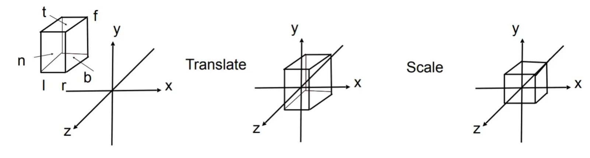
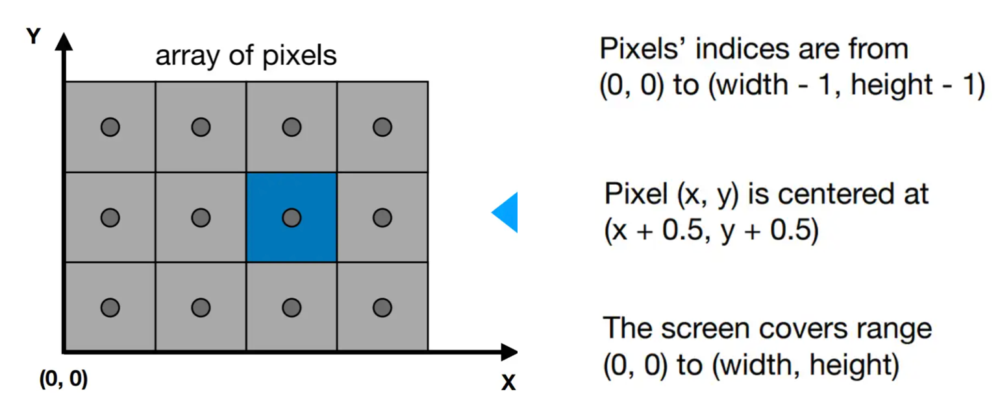
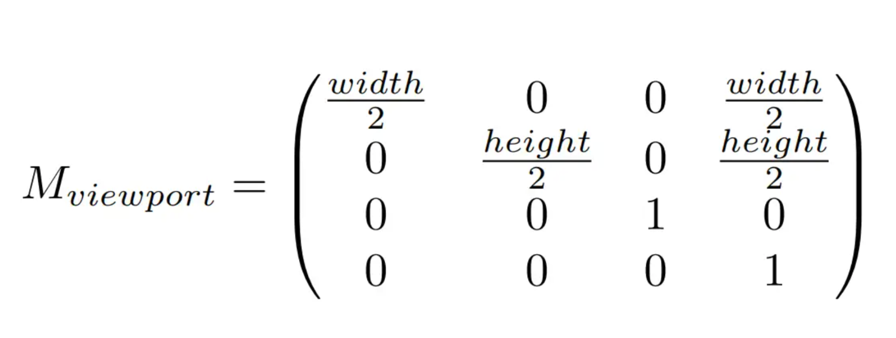
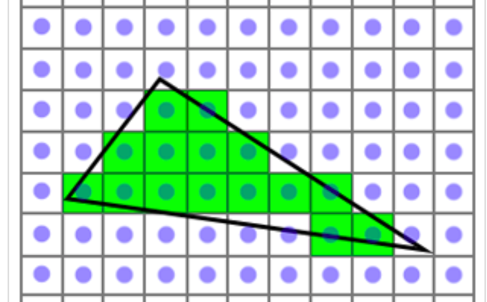
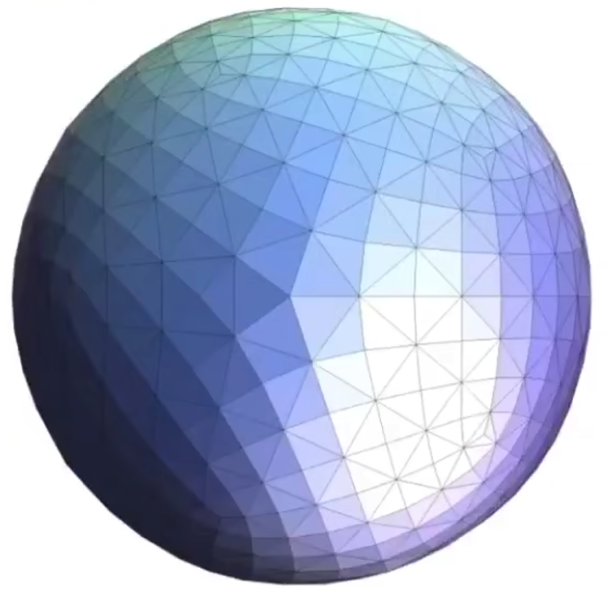
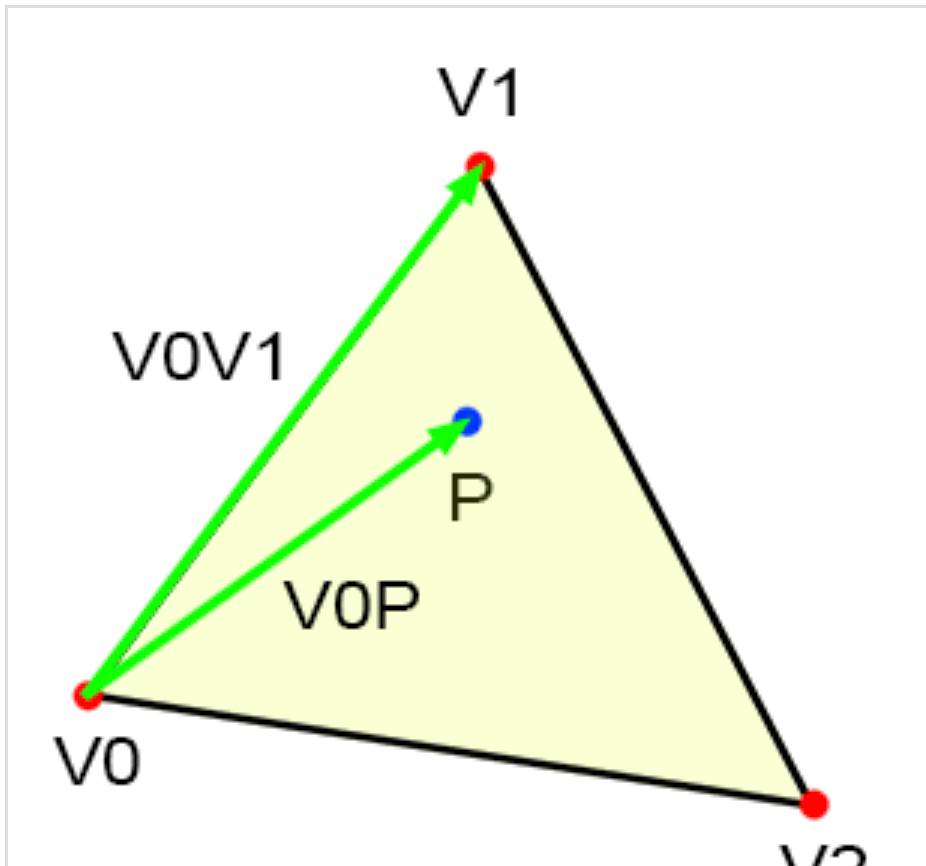
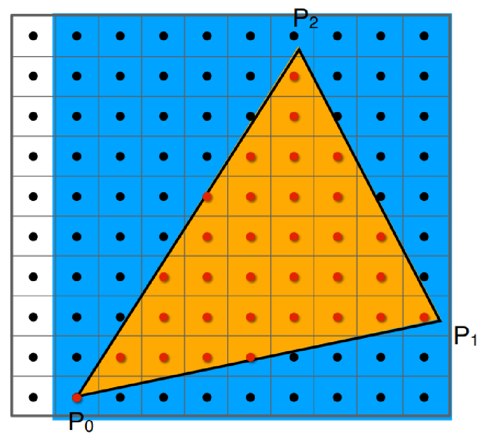
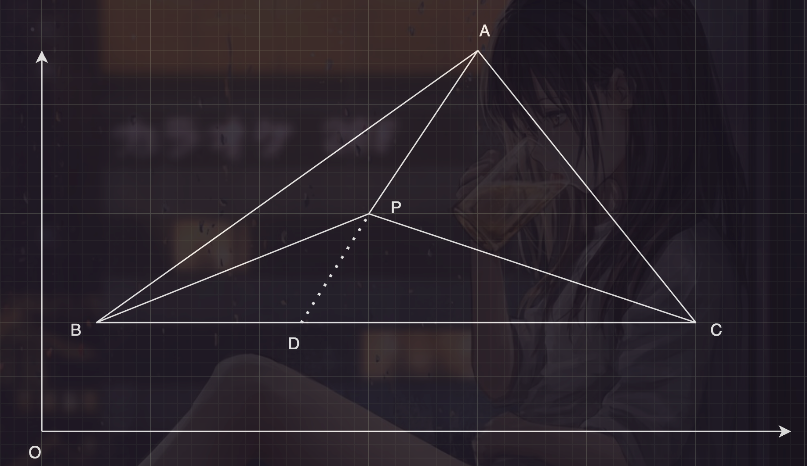
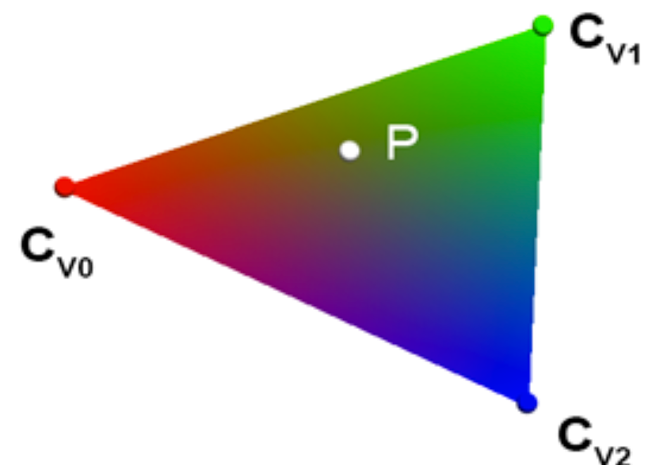

## viewport变换:
投影変更によって、カメラの可視空間から正規化立方体にします。即ち全ての座標はマイナス1からプラス1までに落ちてます。
- その後Viewport変換により, カメラの可視空間をscreenに描きます.
- 下図に示す:

 

***
## screenと言うのは何か？
- screen空間は一連の画素を組み込みしたものです。

 

- 上図のように, pixelは発光する小さな四角形として簡単に定義できます。

***
- screen空間のサイズは（0、0）から（Width, Height）までと定義します。変換行列を次のように構築します:

 

- この変換行列を使用して、(-1, 1)の3乗に位置を定義した正規空間を(Width, Height)のscreenスペースに変換します。

***
## Rasteriz:
- 一般的に、rasterizeとは、screenスペースのobjectを組み込みしたpolygon（通常は三角形）をpixelに変換し、2D画像を描くことを指します。
- 下図に示す:

 

- 三角形を選択するのは、以下の特徴があるからです：
  - 最も基本的な多角形。
  - 他の図形は三角形に分解できる。
  - 三角形の内部は必ず平面である。
- 下図に示す：

 

***
## Rasteriz Method：
### 1. pixelの中心点と三角形の位置関係を判断する: 外積できます.
  - 内外画素を判断する:
    
 

  - 上図に示す：
    - $\overrightarrow{V_{0}P} = \left [P.x - V_{0}.x,  P.y - V_{0}.y \right ]$
    - $\overrightarrow{V_{0}V_{1}} = \left [V_{1}.x - V_{0}.x, V_{1}.y - V_{0}.y \right ]$
    - 内積は: $E01(P)=(P.x - V0.x)\cdot (V1.y - V0.y) - (P.y - V0.y)\cdot (V1.x - V0.x)$
  - vectorを逆に時計回りに回転させることをプラス角度とする場合は、E01(P)の値はプラスであり、点Pはvector`V0V1`の右側にあります。
  - 其他三边同理:
    - E01(P)=(P.x−V0.x)∗(V1.y−V0.y)−(P.y−V0.y)∗(V1.x−V0.x)
    - E12(P)=(P.x−V1.x)∗(V2.y−V1.y)−(P.y−V1.y)∗(V2.x−V1.x)
    - E20(P)=(P.x−V2.x)∗(V0.y−V2.y)−(P.y−V2.y)∗(V0.x−V2.x)
  - もし
    - E01(P) > 0 && E12(P) > 0 && E20(P) > 0
  - だったら, 点Pは三角形の中にいます.

***
- 画面の空間には多数のpixelがありますが、1つの図形要素（三角形）が占めるpixel数は少ないため、各三角形ごとに画面のすべてのpixelを判断する必要はありません。
- テストしたい三角形を囲む境界ボックス（bounding box）を使用し、その境界ボックス内の点のみをサンプリングテストすることができます。
- 下図に示す：

 

### 2. 颜色插值: 通过重心坐标的方式:
  - コンピュータグラフィックスでは、三角形の頂点には色、法線、テクスチャ座標など、複数の属性が含まれています。
  - 一応色彩の属性を例に取り、三角形の3つの頂点の色が既知の場合、三角形の内部の任意の点の色をどのように決定しますか？
  - まず、三角形の内部の任意の点の重心座標を取得します。下図を参照します。
    
 

  - 三角形の面積は、それを構成する2つの辺のvectorの外積の半分に等しいため、
    $\lambda _{abp}$, $\lambda _{acp}$, $\lambda _{bcp}$のように定義したら:
    $$
    \lambda _{abp} = \frac{S\Delta ABP}{S\Delta ABC} = \frac{\frac{\overrightarrow{AB}\times \overrightarrow{AP}}{2}}{\frac{\overrightarrow{AB}\times \overrightarrow{AC}}{2}} = \frac{\overrightarrow{AB}\times \overrightarrow{AP}}{\overrightarrow{AB}\times \overrightarrow{AC}}
    $$
    $$
    \lambda _{acp} = \frac{S\Delta ACP}{S\Delta ABC} = \frac{\frac{\overrightarrow{AC}\times \overrightarrow{AP}}{2}}{\frac{\overrightarrow{AB}\times \overrightarrow{AC}}{2}} = \frac{\overrightarrow{AC}\times \overrightarrow{AP}}{\overrightarrow{AB}\times \overrightarrow{AC}}
    $$
    $$
    \lambda _{bcp} = \frac{S\Delta BCP}{S\Delta ABC} = \frac{\frac{\overrightarrow{BC}\times \overrightarrow{BP}}{2}}{\frac{\overrightarrow{AB}\times \overrightarrow{AC}}{2}} = \frac{\overrightarrow{BC}\times \overrightarrow{BP}}{\overrightarrow{AB}\times \overrightarrow{AC}}
    $$

***
- 線形補間により、点Dの座標を得ることができます:
    $$
    D=(1 - t)B+tC　（t は0から1の間のパラメータです。）
    $$
- 既知：
    $$
    \frac{BD}{DC} = \frac{S\Delta PBD}{S\Delta PCD} = \frac{S\Delta ABP}{S\Delta ACP} = \frac{\lambda _{abp}}{\lambda _{acp}} = \frac{t}{1-t}
    $$
- 得:
    $$
    t = \frac{\lambda_{abp}}{\lambda_{abp} + \lambda_{acp}}
    $$
- 上式を代入して:
    $$
    D=(1 - t)B+tC = \frac{\lambda _{acp}}{\lambda _{abp} + \lambda _{acp}}B + \frac{\lambda _{abp}}{\lambda _{abp} + \lambda _{acp}}C
    $$
- それをvector形式で表して:
    $$
    \overrightarrow{OD}=(1 - t)\overrightarrow{OB}+t\overrightarrow{OC} = \frac{\lambda _{acp}}{\lambda _{abp} + \lambda _{acp}}\overrightarrow{OB} + \frac{\lambda _{abp}}{\lambda _{abp} + \lambda _{acp}}\overrightarrow{OC}
    $$

***
- 而も既知:
    $$
    \frac{AP}{PD} = \frac{AP\cdot \frac{h_{1}}{2} + AP\cdot \frac{h2}{2}}{PD\cdot \frac{h1}{2} + PD\cdot  \frac{h2}{2}} = \frac{S\Delta ABP + S\Delta ACP}{S\Delta PBD + S\Delta PCD} = \frac{\lambda _{abp} +\lambda _{acp}}{\lambda _{bcp}} = \frac{t}{1-t}
    $$
- 線形補間により, 同様に:
    $$
    \overrightarrow{OP}=(1 - t)\overrightarrow{OA}+t\overrightarrow{OD} = \frac{\lambda _{bcp}}{\lambda _{abp} + \lambda _{acp} + \lambda _{bcp}}\overrightarrow{OA} + \frac{\lambda _{abp} + \lambda _{acp}}{\lambda _{abp} + \lambda _{acp} +  \lambda _{bcp}}\overrightarrow{OD}
    $$
- OD vectorを代入して, 得: 
    $$
    \overrightarrow{OP}=(1 - t)\overrightarrow{OA}+t\overrightarrow{OD} = \frac{\lambda _{bcp}}{\lambda _{abp} + \lambda _{acp} + \lambda _{bcp}}\overrightarrow{OA} + \frac{\lambda _{abp} + \lambda _{acp}}{\lambda _{abp} + \lambda _{acp} +  \lambda _{bcp}}\left ( \frac{\lambda _{acp}}{\lambda _{abp} + \lambda _{acp}}\overrightarrow{OB} + \frac{\lambda _{abp}}{\lambda _{abp} + \lambda _{acp}}\overrightarrow{OC} \right ) = \frac{\lambda _{bcp}\overrightarrow{OA} + \lambda _{acp}\overrightarrow{OB} + \lambda _{abp}\overrightarrow{OC}}{1}
    $$

- 最終に、任意の三角形内の点の重心座標を得られる。
- そして、重心座標を使用して、三角形内の任意の点で色属性を補間することができます。
    $$
    C_{p} = \lambda _{bcp}\cdot C_{a} + \lambda _{acp}\cdot C_{b} + \lambda _{abp}\cdot C_{c}
    $$
- 下图に示す:
    
 

